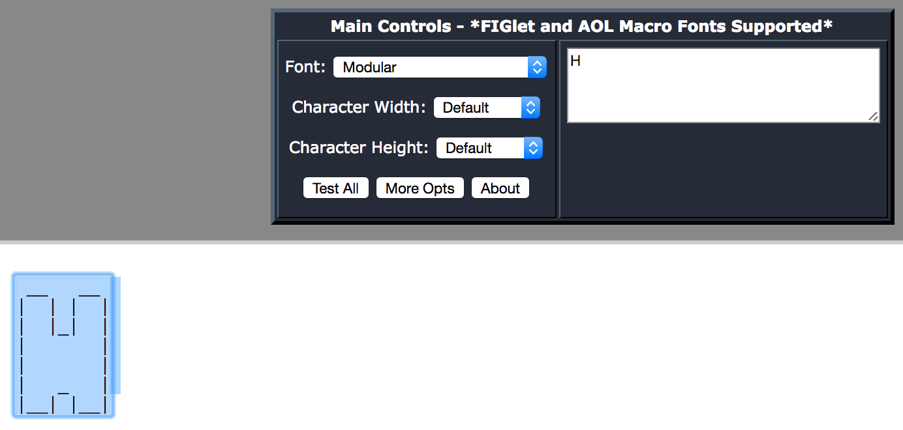

# printf_gen
Making it easy as pie for you to use the Arduino as virtual keyboard to print whatever you want :) It can also be used to convert the string to the format required for printf

[](https://twitter.com/cocoahuke) [](https://travis-ci.org/cocoahuke/printf_gen) [](https://github.com/cocoahuke/printf_gen/blob/master/LICENSE) [](https://www.paypal.com/cgi-bin/webscr?cmd=_s-xclick&hosted_button_id=EQDXSYW8Z23UY)

I was recently interested in Arduino's virtual keyboard, base on ATMEGA32U4 chip. And i'm a hardware knowledge newbie, this is the chip i study for mostly time. Many manufacturers make it to a tiny USB interface device, itself support USB to Serial convert which is really amazing

When used as a virtual keyboard, print out what you want which's simple work, saving bytes become important, this tool can help you solve escape sequences in massive text, such as ascii art font, include as many strings as possible in one function call   
Check out reason and example in rest of Introduction


Here we list several ways that call Keyboard.print(), which is sends a keystroke to a connected computer, and compare the bytes and percentages they occupy

## Call Keyboard.print()

###### Display format: Sketch uses bytes (percent) - Global variables use bytes (percent)

Only listed methods of store data in flash memory instead of SRAM. For a large amount of fixed strings, storing the SRAM is not a good choice


>At begin (I have other code that uses memory)
><strong>4960 bytes (17%) - 153 bytes (5%)</strong>

>Keyboard.write('H');
>Keyboard.write('e');ss
>Keyboard.write('y');
>Keyboard.write('\n');
><strong>5000 bytes (17%) - 153 bytes (5%)</strong>  
><strong>Although this is the smallest now, this is because there is no codes to handle long strings. Once more than a few bytes like 5 letters the shortcomings will be obvious, each letter took 10 bytes. other methods each letter only took 1 bytes</strong>

>Keyboard.print(F("Hey\n"));
><strong>Same as</strong>
static const char _A[ ] PROGMEM = {'H', 'e', 'y', '\n'};  
>Keyboard.print((const __FlashStringHelper *)_A);  
><strong>5050 bytes (17%) - 153 bytes (5%)</strong>
><strong></strong>

>void my_print_flashStr(const >__FlashStringHelper *buf)
>{
>&nbsp;&nbsp;&nbsp;&nbsp;PGM_P p = reinterpret_cast<PGM_P>(buf);
>&nbsp;&nbsp;&nbsp;&nbsp;size_t n = 0;
>&nbsp;&nbsp;&nbsp;&nbsp;while (1) {
>&nbsp;&nbsp;&nbsp;&nbsp;&nbsp;&nbsp;&nbsp;&nbsp;unsigned char c = pgm_read_byte(p++);
>&nbsp;&nbsp;&nbsp;&nbsp;&nbsp;&nbsp;&nbsp;&nbsp;if (c == 0) break;
>&nbsp;&nbsp;&nbsp;&nbsp;&nbsp;&nbsp;&nbsp;&nbsp;if (Keyboard.write(c)) n++;
>&nbsp;&nbsp;&nbsp;&nbsp;&nbsp;&nbsp;&nbsp;&nbsp;else break;
>&nbsp;&nbsp;&nbsp;&nbsp;}
>}
>...
>my_print_flashStr(F("Hey\n"));
>...
><strong>5006 bytes (17%) - 153 bytes (5%)</strong>
><strong>Save some bytes regardless of how long the bytes of content is, Here is 44 bytes</strong>


>Keyboard.println(F("Hey"));
><strong>5140 bytes (17%) - 153 bytes (5%)</strong>

Call `println`s storage occupied is larger than `print`, because it contains more instructions, so use the same function as much as possible.  
For print the same content, although the call is the same function, but call once that include all required string could less storage occupied, more efficient than calls many time with separate content.
Besides, The compiler will not optimize the string stored in Flash, means multiple same strings will occupy the same space, you need to save value to a `const __FlashStringHelper *` type variable, then use it for save memory

## Use example
For example, we need to print a simple function that include code output an ascii art font, use on ATMEGA32U4

FIRST THING, copy structure of the ascii art text from website like [this one](http://patorjk.com/software/taag/#p=display&f=Graffiti&t=Type%20Something%20)


<br>
Run `printf_gen`, paste it, press Enter  
Then press control + c means end of input

Anwser to prompt `[Whether to add Return to the end]`, `Y` is YES, `N` is NO, `C` is CANCEL  
Anwser `Y` mean add a end-of-line symbol at the end

<br>
Copy the output string, although this is the format used for Arduino keyboard, Yet so simple to modify the format to that required for printf by yourself


Put all stuff together, then do convert again


The last output is what you need :)
Just reminded: put as many strings as possible together

## Usage

```
Generate string that format required for printf, use for Arduino Keyboard. Wrote by cocoahuke
Usage:	[-n <variable name>]	specifi name of variable
	[-b <file path>]	read the file in binary and output it
	[-a <file path>]	read the file in ASCII and output it
	[-y]			output in char array instead in one string
```
